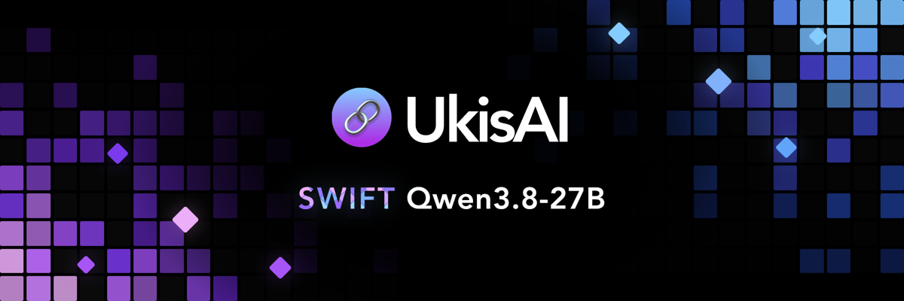

  
  

    <a href="https://ukisai.com"><b>Website</b></a> &nbsp;&bull;&nbsp;
    <a href="https://huggingface.co/ukisai"><b>Hugging Face</b></a> &nbsp;&bull;&nbsp;
    <a href="https://huggingface.co/spaces/ukisai/Swift-27B"><b>Try Swift</b></a> &nbsp;&bull;&nbsp;
    <a href="https://www.linkedin.com/company/ukisai"><b>LinkedIn</b></a>
  

UkisAI is an applied AI lab from Belgrade, Serbia, operating across Europe and the US. We train our own models, ship products used by 20,000+ people, and build production AI for startups, enterprises, and public institutions.

## Swift

Swift-Qwen3.8-27B is our reasoning-efficient derivative of Qwen3.8-27B. It uses **58.3% fewer thinking tokens** while keeping near-identical performance (**&lt;1% loss**), for a **1.95× speed-up** on several tasks.

| Model | Format |
|---|---|
| [Swift-Qwen3.8-27b](https://huggingface.co/ukisai/Swift-Qwen3.8-27b) | BF16 weights |
| [Swift-Qwen3.8-27B-GGUF](https://huggingface.co/ukisai/Swift-Qwen3.8-27B-GGUF) | GGUF for llama.cpp and compatible runners |
| [Swift-Qwen3.8-27B-NVFP4](https://huggingface.co/ukisai/Swift-Qwen3.8-27B-NVFP4) | NVFP4/FP8 mixed precision (NVIDIA Model Optimizer) |
| [Swift-Qwen3.8-27b-int4-AMD](https://huggingface.co/ukisai/Swift-Qwen3.8-27b-int4-AMD) | AMD Quark AWQ INT4 (W4A16) |
| [Swift-Qwen3.8-27b-BF16-AMD](https://huggingface.co/ukisai/Swift-Qwen3.8-27b-BF16-AMD) | BF16 companion for the AMD Quark release |

Try it in your browser on the [Swift 27B Space](https://huggingface.co/spaces/ukisai/Swift-27B). Every per-sample response behind the model card's benchmark numbers is in [Swift-Qwen3.8-27B-evals](https://github.com/UkisAI/Swift-Qwen3.8-27B-evals).

## Open source

- **[Swift-Qwen3.8-27B-evals](https://github.com/UkisAI/Swift-Qwen3.8-27B-evals)**: raw logs, scores, and configs for all 9 Swift benchmarks
- **[vibe-ukis](https://github.com/UkisAI/vibe-ukis)**: CLI toolkit for vibe coding AI products, with Claude Code skills, Cursor/Windsurf rules, and MCP docs servers (`pip install vibe-ukis`)
- **[ukis-research-helper](https://github.com/UkisAI/ukis-research-helper)**: multi-agent research report writer on LlamaIndex, built in an hour with vibe-ukis

## Work with us

Swift is free for individuals and organizations under US$1M in annual revenue. For a Swift Enterprise License or custom model work, [get in touch](https://ukisai.com/contact).
